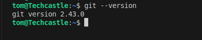
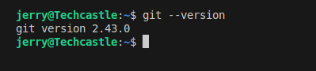
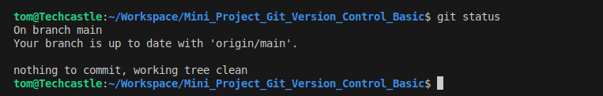
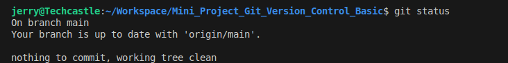

# Mini_Project_Git_Version_Control_Basic

# 1. Initial Stup

## 1.1 Git Installation 

### Tom Git Installed

### Jerry Git Insatlled 

## 1.2 Project Repository Cloning

### Tom Project Repository Cloning

### Jerry Repository Cloning

