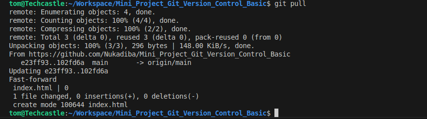
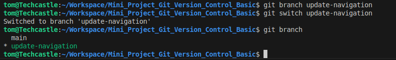
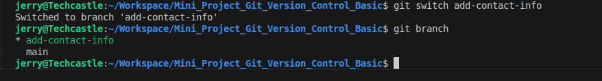

# Mini_Project_Git_Version_Control_Basic

# Github User Dashboard

# 1. Initial Stup

## 1.1 Git Installation 

### Tom Git Installed

### Jerry Git Insatlled 

## 1.2 Project Repository Cloning

### Tom Project Repository Cloning

### Jerry Repository Cloning

# 2. Toms and Jerry Starts Working 

## 2.1 Pull Request 

### Tom pull request from central repository for latest version of index.html

### Jerry pull request from central repository for latest version of index.html

## 2.2 Branch Creation

### Tom Branch creation 

### Jerry Branch creation 

